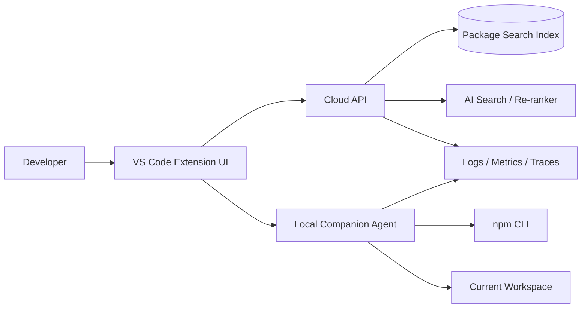

# Low-Level Design: Package Search & Install MVP

## 1. Overview

This document defines the first production-grade MVP for a developer tool that lets users search for packages and install them into the current development workspace with minimal friction.

The MVP scope is intentionally narrow:

- One ecosystem: `npm`
- One primary use case: search, inspect, and install a package into the active project
- One optional differentiator: AI-assisted intent search

The product is assumed to ship as a **VS Code extension** with a **local companion agent** and a **cloud backend**. This gives us:

- Native access to the current workspace
- Safe local execution of install commands
- Centralized search and AI orchestration
- A clear path to enterprise controls later

## 2. Goals

- Let a developer find a package by name or by describing the problem they are trying to solve
- Show trustworthy package metadata before install
- Install a selected package into the active `npm` workspace
- Avoid shell injection and unsafe arbitrary command execution
- Make the experience fast, observable, and recoverable

## 3. Non-Goals

- Python package installs
- JDK / JVM SDK installs
- Arbitrary shell command execution
- Full dependency graph analysis
- Package publishing
- Enterprise governance workflows in v1
- Offline-only mode

## 4. Assumptions

- The user works in VS Code or a compatible editor supporting extension hosts
- The local project has an `npm` workspace or standard Node project
- The machine has `npm` available, or the companion agent can locate it
- The backend may call an AI model for query understanding, but the AI is never allowed to install anything directly
- All package installs are performed locally through a constrained agent

## 5. High-Level Architecture



### Responsibility Split

- **VS Code extension**
  - Renders search and install UI
  - Detects the current workspace
  - Requests search results from the backend
  - Sends install requests to the local agent

- **Cloud API**
  - Authenticates users
  - Executes lexical and semantic package search
  - Calls AI services for intent understanding and ranking
  - Enforces rate limits, audit logging, and feature flags

- **Local companion agent**
  - Validates package names, versions, and install targets
  - Executes `npm install` with sanitized arguments
  - Streams logs and exit state back to the extension
  - Never contacts untrusted domains for install logic

- **Search index**
  - Stores normalized package metadata
  - Supports keyword and semantic retrieval
  - Holds precomputed embeddings for package descriptions and README excerpts

## 6. User Flow

### 6.1 Search Flow

1. User opens the extension panel.
2. User enters either:
   - a package name, or
   - an intent phrase like “HTTP client for Node”.
3. Extension sends the query and workspace context to the backend.
4. Backend:
   - normalizes the query,
   - does lexical lookup against the package index,
   - optionally uses AI to rewrite or expand intent,
   - merges and ranks results.
5. Extension displays a ranked list with:
   - package name
   - latest stable version
   - short summary
   - weekly downloads
   - license
   - trust indicators
   - install action

### 6.2 Install Flow

1. User selects a package and version.
2. Extension sends an install request to the local agent.
3. Agent validates:
   - package name format
   - version format
   - workspace eligibility
   - allowed package manager command template
4. Agent resolves the active workspace root.
5. Agent runs the install command with arguments only, never by concatenating raw shell text.
6. Agent streams progress and captures exit status.
7. Extension shows success/failure, logs, and the package manifest diff.

## 7. Functional Requirements

### Search

- Search by exact package name
- Search by partial name
- Search by natural language intent
- Show top results with ranking explanations
- Support version visibility
- Support package metadata preview

### Install

- Install into the active project
- Support selecting a version
- Update `package.json` and lockfile
- Surface command output and errors
- Allow cancellation

### Safety

- Block arbitrary command input
- Validate package and version strings
- Prevent install outside workspace root
- Require explicit user confirmation before install

### Reliability

- Fallback to lexical search if AI is unavailable
- Fail closed if workspace validation fails
- Retry transient backend calls with bounded backoff

## 8. API Design

The cloud backend exposes versioned REST APIs.

### `POST /v1/search`

Request:

```json
{
  "query": "http client for node",
  "workspace": {
    "manager": "npm",
    "rootPathHash": "sha256:...",
    "packageJsonPresent": true
  },
  "filters": {
    "ecosystem": "npm",
    "license": ["MIT", "Apache-2.0"]
  }
}
```

Response:

```json
{
  "queryId": "qry_123",
  "results": [
    {
      "package": "undici",
      "version": "7.13.0",
      "summary": "Node.js HTTP client",
      "downloadsWeekly": 12000000,
      "license": "MIT",
      "score": 0.97,
      "reason": "Matches intent for a modern HTTP client"
    }
  ],
  "aiUsed": true
}
```

### `POST /v1/install-requests`

Request:

```json
{
  "workspaceId": "ws_123",
  "package": "undici",
  "version": "7.13.0",
  "manager": "npm"
}
```

Response:

```json
{
  "installRequestId": "ins_123",
  "status": "queued"
}
```

### `GET /v1/install-requests/{id}`

Returns install progress, logs, and final outcome.

## 9. Local Agent Design

The local agent is a small process installed on the developer machine. The extension talks to it over `localhost` using authenticated, short-lived session tokens.

### Agent responsibilities

- Discover the workspace root
- Validate the install request
- Execute the package manager using a structured subprocess call
- Capture stdout, stderr, and exit code
- Emit progress events

### Allowed command shape

For `npm`, the agent should only support approved templates such as:

- `npm install <pkg>@<version>`
- `npm install --save-dev <pkg>@<version>`

The agent must not:

- accept raw shell strings
- allow command chaining
- allow arbitrary flags beyond the approved allowlist

## 10. Data Model

### `package_document`

- `id`
- `ecosystem`
- `name`
- `version`
- `summary`
- `description`
- `homepage_url`
- `repository_url`
- `license`
- `keywords`
- `downloads_weekly`
- `last_published_at`
- `deprecated`

### `package_embedding`

- `package_id`
- `chunk_type` (`summary`, `readme`, `keywords`)
- `vector`
- `updated_at`

### `search_event`

- `id`
- `user_id`
- `query_text`
- `ecosystem`
- `query_type` (`keyword`, `intent`)
- `top_result_package`
- `clicked_package`
- `created_at`

### `install_job`

- `id`
- `user_id`
- `workspace_id`
- `manager`
- `package`
- `version`
- `status`
- `exit_code`
- `stdout_ref`
- `stderr_ref`
- `created_at`
- `completed_at`

## 11. Search and Ranking Strategy

The backend should combine multiple signals:

1. Lexical match on package name and keywords
2. Semantic similarity from embeddings
3. Popularity signals such as weekly downloads
4. Freshness such as last publish date
5. Trust signals such as license and repository presence
6. AI-generated query rewrite or package rationale

### Ranking rule

The final score should be deterministic enough to debug:

```text
final_score =
  lexical_score * 0.35 +
  semantic_score * 0.30 +
  popularity_score * 0.15 +
  freshness_score * 0.10 +
  trust_score * 0.10
```

The AI layer should improve recall and explanations, but not become the sole ranking authority.

## 12. AI Search Design

AI is used for:

- intent parsing
- query rewriting
- candidate explanation
- fallback suggestion generation

AI is not used for:

- install execution
- silent package selection
- bypassing package registry truth

### AI safety rules

- The model only sees the user query and package metadata
- The model cannot invent package metadata
- The model output must be validated against the package index
- If the model fails or times out, fall back to lexical search

## 13. Security Design

### Threats

- Command injection through package names or versions
- Workspace escape attacks
- Malicious or typo-squatted packages
- Unauthorized install attempts
- Token leakage in logs

### Mitigations

- Strict package name and version validation
- Structured process execution, never shell interpolation
- Workspace root boundary checks
- Signed or short-lived auth tokens
- Redaction of secrets in logs
- Rate limiting on search and install APIs
- Audit logging for every install request

### Package trust signals

For every result, show at least:

- package name
- version
- license
- repository link
- publish recency
- download trend

If trust metadata is missing, label it clearly instead of hiding it.

## 14. Observability

### Metrics

- search request count
- search latency p50/p95/p99
- install request count
- install success rate
- AI usage rate
- AI fallback rate
- top zero-result queries
- cancellation rate

### Logs

- request IDs
- query IDs
- workspace IDs
- install job IDs
- agent exit codes

### Traces

- API search span
- AI rewrite span
- index lookup span
- local agent install span

## 15. Error Handling

### Search failures

- Backend timeout: return cached or lexical-only results if available
- AI failure: continue with index-based ranking
- Empty result set: suggest related packages and broadened query terms

### Install failures

- Invalid package/version: fail fast with clear validation error
- Workspace not writable: show permission guidance
- `npm` missing: show setup instructions
- Network failure: surface retry option and preserve logs
- Install script failure: show stderr summary and full log link

## 16. Performance Targets

- Search API p95 latency: under 1.5 seconds
- Install request acknowledgement: under 300 ms
- Local agent startup: under 2 seconds warm start, under 5 seconds cold start
- Result render after response: under 200 ms in the extension UI

## 17. Testing Strategy

### Unit tests

- query normalization
- package/version validation
- ranking score computation
- command template generation
- log redaction

### Integration tests

- registry search fixture tests
- AI fallback behavior
- local agent install command execution
- workspace root detection

### End-to-end tests

- search from UI to backend
- AI intent query to result list
- install into sample workspace
- failure and cancellation flows

### Security tests

- injection attempts in package and version strings
- workspace escape attempts
- token redaction in logs

## 18. Deployment

### Cloud backend

- Stateless application behind a load balancer
- Autoscaling based on request volume
- Centralized secrets management
- Blue/green or canary deploys

### Local agent

- Versioned release channel
- Signed updates
- Backward-compatible API with the extension

### Feature flags

- AI search on/off
- install flow on/off
- telemetry sampling rate
- enterprise policy enforcement

## 19. Rollout Plan

### Phase 1

- Internal dogfood
- `npm` search and install only
- Keyword search as default
- AI search behind a flag

### Phase 2

- Intent search promoted to first-class feature
- Better package trust signals
- Improved ranking tuning

### Phase 3

- Python support
- Team policies and allowlists
- Shared package catalogs

## 20. Open Questions

- Should the first client be VS Code only, or also ship as a desktop app?
- Should users authenticate with email magic link, OAuth, or SSO first?
- Should the package index be built from live registry calls, a cache, or both?
- Should installs support `dependencies` and `devDependencies` in v1, or only a default install path?

## 21. Recommendation

For the first production-grade MVP, build:

- VS Code extension
- Cloud search API
- Local agent for safe installs
- `npm` only
- AI-assisted intent search as an optional layer

This gives the product a clear wedge while keeping the system secure and expandable.
